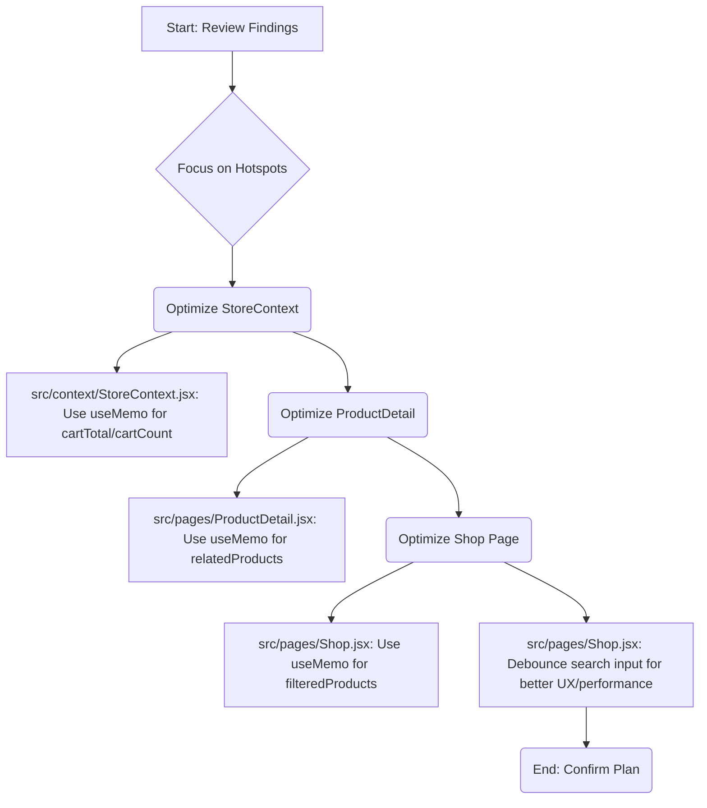

# Codebase Performance Scan: Findings and Optimization Plan

## 1. Critical Paths Identified

The critical path for rendering is the standard React application shell and page component loading, primarily managed by the setup in [`src/App.jsx`](src/App.jsx).

*   **App Shell Loading:** The application is wrapped in several high-level providers and wrappers: `<ErrorBoundary>`, `<StoreProvider>`, `<Router>`, and page transition logic (`<AnimatePresence>` from `framer-motion`).
*   **Initial Page Load:** All main routes use lazy loading (`lazyLoad(() => import('./pages/...'))`), which is a good practice for bundle splitting. The critical path involves the initial bundle, the framework dependencies (`react-router-dom`, `framer-motion`, `react-hot-toast`), and the subsequent lazy-loaded page component.
*   **State Re-renders:** The whole application is wrapped in `<StoreProvider>` ([`src/App.jsx`](src/App.jsx:84)). Changes to the global `cart` or `wishlist` state will re-render the entire component tree below the provider, potentially leading to unnecessary re-renders in unrelated components (e.g., `<Header>` or `<Footer>`).

## 2. Performance Hotspots Identified

### A. Product Data Filtering (Major Hotspot)
*   **File:** [`src/pages/Shop.jsx`](src/pages/Shop.jsx:47)
*   **Issue:** The entire product list (`products`) is filtered and searched on every component render caused by filter/search input changes. As the product list grows, this synchronous, client-side filtering becomes a major bottleneck. The custom category matching logic (`getCategoryMatch`) also adds to the processing time.

### B. Context-Derived Values (Minor Hotspot)
*   **File:** [`src/context/StoreContext.jsx`](src/context/StoreContext.jsx:115)
*   **Issue:** Calculated values like `cartTotal` and `cartCount` are derived directly in the `StoreProvider`'s body. These calculations run on every render of the provider, even if the underlying `cart` state hasn't changed (though in this case, state changes are the likely cause). Memoization is necessary to prevent repeated array reductions.

### C. Related Products Calculation (Minor Hotspot)
*   **File:** [`src/pages/ProductDetail.jsx`](src/pages/ProductDetail.jsx:41)
*   **Issue:** The `relatedProducts` array is calculated by filtering the entire `products` array on every render of the `ProductDetail` page. This is redundant work that should be memoized.

## 3. Files for Optimization

| File | Issue | Proposed Optimization |
| :--- | :--- | :--- |
| [`src/pages/Shop.jsx`](src/pages/Shop.jsx) | Heavy client-side filtering/search on product data. | Use `useMemo` to memoize `filteredProducts`. Consider debouncing the `searchTerm` input. |
| [`src/pages/ProductDetail.jsx`](src/pages/ProductDetail.jsx) | Unnecessary re-calculation of `relatedProducts`. | Use `useMemo` to memoize the `relatedProducts` calculation. |
| [`src/context/StoreContext.jsx`](src/context/StoreContext.jsx) | Un-memoized derived values (`cartTotal`, `cartCount`). | Use `useMemo` for `cartTotal` and `cartCount` to avoid re-calculation. |

## Optimization Implementation Plan

The following plan is proposed to address the identified hotspots.

### Todo List for Implementation

I will now update the todo list to reflect the concrete implementation steps for these optimizations.

[x] Analyze product data size and structure in src/data/products.js.
[x] Read and analyze core application setup in src/App.jsx and src/main.jsx for critical path analysis.
[x] Analyze product-related components: src/pages/Shop.jsx, src/pages/ProductDetail.jsx, and src/components/ProductCard.jsx for rendering hotspots.
[x] Analyze state management in src/context/StoreContext.jsx for performance bottlenecks.
[x] Summarize findings, identify critical paths, performance hotspots, and files for optimization.
[ ] Present the plan and findings to the user for approval.
[ ] Request to switch to code mode for implementation.